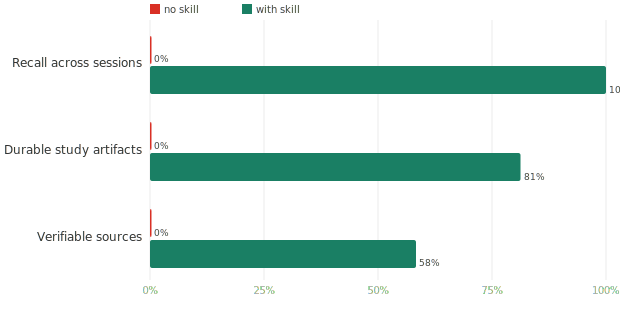
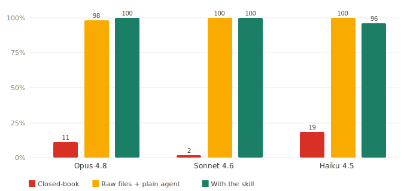

<div align="center">


# Exam Cram Coach

*One night left. You studied nothing. It won't make anything up.*

English · [中文](README.zh.md)

[](https://github.com/ZeKaiNie/universal-examprep-skill/stargazers)
[](LICENSE)
[](https://github.com/ZeKaiNie/universal-examprep-skill/actions)

**Close the chat, nothing's lost: cross-session recall 0 → 100%** · grounded 87–100% · never fabricates (≈100% abstention) · context −90%

</div>

You know him. Night before the exam, hair a mess, eyes wide open, hasn't read a single page of the course. This skill is for him — it doesn't pour in more "knowledge" that it isn't sure about; it teaches only what's actually in *your* materials, and says "not in the materials" for everything else.

**30-second start** — clone the repo, then say one line to your agent:

```bash
git clone https://github.com/ZeKaiNie/universal-examprep-skill .claude/skills/universal-exam-cram-coach
# In Claude Code / Cursor, say: "use this skill to set up my exam-prep space", then drop in your materials
```

---

## Before / after

**With the skill** — every claim carries its source, so you can check it:

> **[#vis_q1]** In the figure, which set relation does the shaded region show?
> **The intersection of A and B.**
> `Question: hw02.pdf p.3 | Answer: hw02_sol.pdf | 🟢 from your materials`

**Closed-book / plain agent** — sounds just as confident, but you can't tell if it's true:

> The shaded region is the **union**. <sub>(It's actually the intersection; no source label, nothing to check against — this is where hallucination happens.)</sub>

The difference isn't tone. It's whether each claim lands back in your materials.

---

## Numbers

v4 measures the **whole study cycle**, not just single-question Q&A. We ran a plain no-skill agent and the skill on the **same materials, same questions, same session scripts** (teach 3 → quiz → *fresh* next-day recall → cheat-sheet), and scored the study-loop metrics **deterministically** — no LLM judge, just parsing what landed on disk.

**① The night-before payoff — a no-skill agent leaves you empty-handed.** It scores **0 on every durability dimension**: it can't recall what you got wrong once the chat closes, leaves no study artifacts, and cites no checkable source. The skill does all three.

<div align="center"></div>

| What survives the night | No skill | With the skill |
|---|:--:|:--:|
| **Recall across sessions** — a *brand-new* chat, "which did I get wrong?": it reads your mistake book off disk and tells you the exact question | **0%** | **100%** |
| **Durable artifacts** — notebook + mistake book + a printable cheat-sheet PDF left in your workspace | **0%** | **81%** |
| **Verifiable sources** — every taught claim carries a source label you can check | **0%** | **58%** ¹ |

¹ One-shot automated runs are noisier than a real interactive session (PSYC 100%, 6.006 17% — the model doesn't always emit the source line under harder algorithm content; interactively it iterates until it does). The load-bearing result is the *structural* zero for no-skill on all three.

**② In the moment, it stays grounded and honest.** On details only someone who read your materials would know, closed-book collapses and the skill returns; on questions the materials don't answer, it abstains instead of fabricating; and its retrieval routes to the right chapter most of the time (judge: Sonnet; deterministic recall trace).

<div align="center"> </div>

| Grounding | Closed-book | With the skill |
|---|:--:|:--:|
| Materials-specific correctness | 2%–49% | **87%–100%** |
| Retrieval hits the right chapter (recall@1) | — | **74%–100%** |
| Out-of-scope: honest "not in the materials" | 50%–90% | **≈100%** |

Full method, session scripts, deterministic scorers, and honest limitations → **[test report](benchmark/REPORT.en.md)**.

---

## How it works

A ladder of "don't make it up unless you have to":

1. **Quiz only from the materials** — questions come from a `quiz_bank.json`, never improvised.
2. **Forced source labels** — every claim tagged `🟢 from your materials` / `🟡 AI-supplemented, may differ from your teacher` / `⚠️ AI-generated answer`, never passed off as the textbook.
3. **If it's not in the materials, say so** — abstains honestly on uncovered questions instead of fabricating (100% out-of-scope abstention, measured).
4. **Draw-it questions run the algorithm first** — for binary trees / graph traversal, it runs the real algorithm in the background to get the topology, then renders — no imagining.
5. **Figure-dependent questions won't be served without the figure** — no unanswerable question handed to the student.
6. **Chapter-sliced knowledge base, loaded on demand** — sliced by chapter, loaded by progress, so long chats don't blow up the context. **Context −90%.**

---

## Study modes · time budget · preferences

The skill adapts how deep it teaches, how fast, and whether it asks you questions — all kept in `study_state.json`, persistent across chats.

**3 study modes** (how it teaches):

| Mode | For |
|---|---|
| **Teach from scratch** | Haven't studied at all — walk every chapter from zero, 7-step walkthrough per key question |
| **Start mid-course, shore up weak spots** | Know some — start from a chapter you name, target the weak parts |
| **Fill the gaps** | Mostly covered — just quiz to find blind spots, mistakes first |

**4 time budgets** (how fast):

| Budget | Behavior |
|---|---|
| **≤ 1 day** | All-out sprint — **never asks you anything**, silently infers defaults (teach-from-scratch), goes straight in |
| **1–3 days** | Hits the essentials, compresses the rest |
| **3–7 days** | Normal pace, asks which chapters you're solid on |
| **> 7 days** | Relaxed — for chapters you say you know, it **quizzes to verify** rather than taking your word |

**Preferences** (remembers your habits): whether walkthroughs append the "common mistakes" / "3-minute recap" closing blocks, reply language (Chinese / English / bilingual), and per-chapter mastery windows (`window-add` / `window-set-status`) — all persisted, changed by a single line anytime. See [`docs/language-policy.md`](docs/language-policy.md) and [`docs/skill-architecture.md`](docs/skill-architecture.md).

---

## Install

### Claude Code

**Recommended — the runtime bundle** (a ~230 KB zip with just the skill, none of the dev weight):

Download `universal-exam-cram-coach.zip` from the [latest release](https://github.com/ZeKaiNie/universal-examprep-skill/releases/latest) and unzip it into `.claude/skills/universal-exam-cram-coach/` (project-local or global `~/.claude/skills/`).

No dependencies to install up front — the core is pure stdlib. If your materials include PDFs, the agent runs the bundled dependency preflight (`scripts/check_deps.py`) at setup and offers the exact one-line install **before** starting, so nothing fails mid-build.

**Or clone the repo** (developer path — brings benchmark/tests along, ~3.4 MB):

```bash
git clone https://github.com/ZeKaiNie/universal-examprep-skill .claude/skills/universal-exam-cram-coach
```

### Codex / Cursor / Windsurf / Antigravity

Clone the repo; have the agent read `AGENTS.md` (a one-screen fallback contract) or load `skills/`. These tools write files and run scripts directly.

### Web (ChatGPT / DeepSeek / Gemini)

Can't write local files — use the drop-in prompt instead: copy [`prompts/web_prompt.en.md`](prompts/web_prompt.en.md) and send it, then paste your materials.

> Full load matrix (per-agent support, entry files) in [`docs/agent-portability.md`](docs/agent-portability.md). The trigger entry is [`SKILL.md`](SKILL.md) (a language-neutral router); [`locales/en/SKILL.md`](locales/en/SKILL.md) is the full English manual it dispatches to (derived rendering of [`locales/zh/SKILL.md`](locales/zh/SKILL.md)).

---

## Sub-skills

The monolith is split into 9 single-purpose sub-skills the agent loads on demand:

| Sub-skill | What it does |
|---|---|
| `exam-cram` | Orchestrator — runs the 4-step workflow + study-mode routing |
| `exam-ingest` | Builds the workspace from your materials (knowledge base + quiz bank + progress) |
| `exam-tutor` | Lazy per-chapter teaching (7-step walkthroughs, draw-it-runs-algorithm-first) |
| `exam-quiz` | Draws & grades from the bank (6 question types: MC / short / draw / fill / T-F / code) |
| `exam-review` | Mistakes and concept-confusion review |
| `exam-cheatsheet` | Pre-exam cheat sheet |
| `exam-audit` | Read-only workspace health check |
| `exam-help` | One-screen quick reference (workflow / modes / file conventions) |
| `confusion-tracker` | Logs concept questions as you go into a pre-exam blind-spot list |

All nine live under [`skills/`](skills/) (e.g. [`skills/confusion-tracker/SKILL.md`](skills/confusion-tracker/SKILL.md)), loaded on demand.

---

## Development

Zero-cost structured checks you can run often (no API spend):

```bash
python -m unittest discover -s tests -v          # unit tests (pure stdlib, in CI)
python scripts/validate_workspace.py path/to/ws  # validate a built exam-prep workspace
```

The real paid benchmark is expensive (tens of dollars / hours per matrix), run manually only — see [`benchmark/docs/running-real-runs.md`](benchmark/docs/running-real-runs.md) and the tiering in [`benchmark/docs/test_tiers.md`](benchmark/docs/test_tiers.md). Workspace file format: [`docs/file-format.md`](docs/file-format.md).

---

## FAQ

**No Python installed?** Fine. When the agent finds no Python it silently switches to "manual write mode", creating the knowledge-base tree itself — no difference to you.

**Only photos / scanned PDFs / a recording?** First transcribe with any free web multimodal AI ("extract the highlights and questions as plain text, keep the star/underline markers"), paste into a `.txt`, then have the agent build the workspace; the rest is plain-text and smooth. Recordings: transcribe first, then feed.

**Stuck on one quiz question?** Just say "this is too hard / I want to skip" — it files the item to your mistake log, lets you through, and revisits it at the end.

**How is this different from just dropping a folder at an AI?** Similar accuracy, but the skill is cheaper (only the relevant chapters per question, not the whole pile) and helps weaker models more. See the [report](benchmark/REPORT.en.md).

---

## License

[MIT](LICENSE). PRs for more subjects' templates or scripts welcome. Good luck on the cram. 🎓

<div align="center">

<a href="https://www.star-history.com/?repos=ZeKaiNie%2Funiversal-examprep-skill&type=date&legend=top-left">
 <picture>
   <source media="(prefers-color-scheme: dark)" srcset="https://api.star-history.com/chart?repos=ZeKaiNie/universal-examprep-skill&type=date&theme=dark&legend=top-left&sealed_token=q2eC20GmpWMHMen634RnHHNopx3dtYK6mzpbK0tB8B7sBn_LT0IKz-TYsaaWMY5xLJ6i7bsHedSzBxs4DU6cD5vZ8HFc-ZD2XAlqm5MnqBbf-ZbEq8zr2A" />
   <source media="(prefers-color-scheme: light)" srcset="https://api.star-history.com/chart?repos=ZeKaiNie/universal-examprep-skill&type=date&legend=top-left&sealed_token=q2eC20GmpWMHMen634RnHHNopx3dtYK6mzpbK0tB8B7sBn_LT0IKz-TYsaaWMY5xLJ6i7bsHedSzBxs4DU6cD5vZ8HFc-ZD2XAlqm5MnqBbf-ZbEq8zr2A" />
   
 </picture>
</a>

</div>
