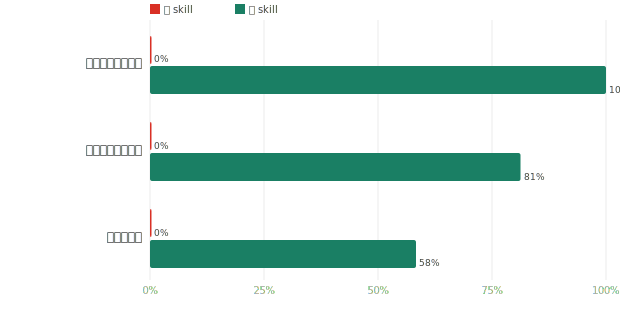
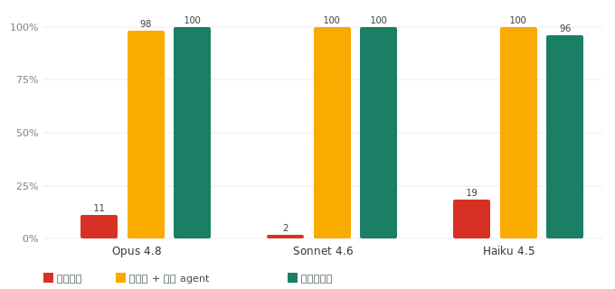
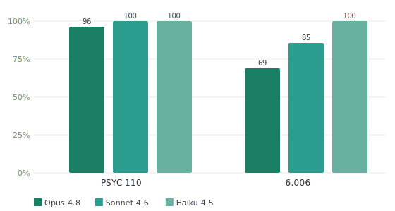

<div align="center">


# 期末极速备考教练

*只剩一晚。你什么都没复习。它不会瞎编。*

中文 · [English](README.md)

[](https://github.com/ZeKaiNie/universal-examprep-skill/stargazers)
[](LICENSE)
[](https://github.com/ZeKaiNie/universal-examprep-skill/actions)

**关掉聊天，什么都不丢：跨会话找回错题 0 → 100%** · grounding 正确率 87–100% · 从不乱编（越界 ≈100% 弃答） · 上下文省 90%

</div>

你认识他。考试前夜，头发乱成一团，眼睛瞪得溜圆，一整门课一个字没看。这个技能是给他的——不再灌一堆它自己都拿不准的"知识"，只讲你资料里真有的东西，其余的老实说"资料里没有"。

**30 秒上手** —— 克隆整个仓库，然后对你的智能体说一句话：

```bash
git clone https://github.com/ZeKaiNie/universal-examprep-skill .claude/skills/universal-exam-cram-coach
# 对 Claude Code / Cursor 说："用这个技能初始化我的备考空间"，再把讲义/大纲/真题丢进来
```

---

## 装上前后

**装上技能**——每条结论都带来源，能核对：

> **[#vis_q1]** 题面图里阴影区域表示哪个集合关系？
> **A 与 B 的交集。**
> `题目来源：hw02.pdf 第 3 页｜答案来源：hw02_sol.pdf｜🟢 来自资料`

**闭卷 / 裸智能体**——听起来一样自信，但你无从判断真假：

> 阴影是**并集**。<sub>（资料里其实是交集；没有来源标注，无从核对——这正是"瞎编"发生的地方。）</sub>

区别不在口气，在于**每个结论能不能落回你的材料**。

---

## 实测数据

v4 测的是**整个备考循环**，不只是单题问答。我们让一个「无技能通用智能体」和「装上技能」在**同一批材料、同一批题、同一套会话脚本**上跑（教 3 题 → 测验 → **隔一场全新对话**回忆 → 出小抄），备考循环的指标全部**确定性判分**——不用 LLM 裁判，只解析真正落到磁盘上的东西。

**① 考前一晚的分水岭——无技能会让你两手空空。** 它在三个「耐久维度」上**全部 0 分**：聊天一关就想不起你错在哪、不留下任何复习产物、说不出可核对的出处。技能三样全做到。

<div align="center"></div>

| 关掉聊天，什么还在 | 无技能 | 有技能 |
|---|:--:|:--:|
| **跨会话找回错题** —— 开一场**全新**对话问「我上次错了哪道」，它读磁盘上的错题本、说出那道具体的题 | **0%** | **100%** |
| **留得下的产物** —— 工作区里留下笔记本 + 错题本 + 可打印的小抄 PDF | **0%** | **81%** |
| **句句有出处** —— 每条讲解都带你能核对的来源标注 | **0%** | **58%** ¹ |

¹ 一次性自动化跑批比真人交互会话更抖（PSYC 100%、6.006 17%——算法内容更难时模型不总记得带来源行；交互时它会反复补到带上为止）。真正压舱的结论是：无技能在这三项上**结构性地为 0**。

**② 当下这一刻，它扎实且诚实。** 面对「只有看过你材料才知道」的细节，闭卷全崩、技能接回来；面对材料里根本没有的问题，它如实弃答而不硬编；它的检索大多数时候能路由到正确章节（判分 Sonnet；检索命中为确定性轨迹）。

<div align="center"> </div>

| grounding | 闭卷 | 有技能 |
|---|:--:|:--:|
| 材料专属细节正确率 | 2%–49% | **87%–100%** |
| 检索命中正确章节（recall@1） | —— | **69%–100%** |
| 越界题如实说「材料里没有」 | 50%–90% | **≈100%** |

完整方法、会话脚本、确定性判分器、诚实局限 → **[测试报告](benchmark/REPORT.md)**。

---

## 怎么做到的

一条"能不编就不编"的阶梯：

1. **只从资料出题** —— 测验题来自 `quiz_bank.json` 真题库，不即兴编题。
2. **来源强制标注** —— 每条结论标 `🟢 来自资料` / `🟡 AI 补充，可能与老师讲的不一致` / `⚠️ AI 生成答案`，绝不冒充教材。
3. **资料里没有就说没有** —— 遇到资料未覆盖的问题，如实弃答，不硬编（实测越界弃答 100%）。
4. **画图题先跑算法再画** —— 二叉树 / 图遍历这类题，后台跑标准算法求出拓扑再渲染，禁止凭空想象。
5. **图依赖题缺图不出** —— 需要配图却没图的题绝不出，不给学生一道没法答的题。
6. **分章知识库按需加载** —— 按章切片、按进度加载，长对话不撑爆上下文，**上下文省 90%**。

---

## 复习模式 · 时间宽裕度 · 偏好

技能会按你的处境调节讲解的深浅、节奏和是否追问，都记在 `study_state.json` 里、跨对话不丢。

**3 种复习模式**（怎么讲）：

| 模式 | 适合 |
|---|---|
| **零基础从头讲** | 完全没学过，从第一章逐步讲透、每道重点题走七步模板 |
| **某章起步补弱** | 前面会一些，从指定章节开始、重点补薄弱环节 |
| **查缺补漏** | 大致都学过，只做题扫盲区、错题优先 |

**4 档时间宽裕度**（多快）：

| 宽裕度 | 行为 |
|---|---|
| **≤ 1 天** | 极限冲刺——**绝不向你提问**，静默推断默认（零基础从头讲），直接开讲 |
| **1–3 天** | 抓重点，压缩非核心 |
| **3–7 天** | 正常节奏，会回问你哪些章有把握 |
| **> 7 天** | 从容——对你说"有把握"的章**出题实测**而非只口头确认 |

**偏好**（记住你的习惯）：讲解模板要不要带【易错点】/【3 分钟速记】收尾块、回复语言（中文 / English / 双语）、每章的知识点掌握窗口（`window-add` / `window-set-status`）——都持久化，随时说一句就改。详见 [`docs/language-policy.md`](docs/language-policy.md) 与 [`docs/skill-architecture.md`](docs/skill-architecture.md)。

---

## 安装

### Claude Code

**推荐——运行时精简包**（约 230 KB 的 zip，只含技能本体，不带开发用的 benchmark/测试）：

到[最新 release](https://github.com/ZeKaiNie/universal-examprep-skill/releases/latest) 下载 `universal-exam-cram-coach.zip`，解压到 `.claude/skills/universal-exam-cram-coach/`（项目内或全局 `~/.claude/skills/` 均可）。

无需预装任何依赖——核心是纯标准库。材料里有 PDF 时，智能体会在建库**之前**运行自带的依赖预检（`scripts/check_deps.py`），把需要的安装命令一次性问清装好，绝不中途报错。

**或克隆整仓**（开发者路径，约 3.4 MB）：

```bash
git clone https://github.com/ZeKaiNie/universal-examprep-skill .claude/skills/universal-exam-cram-coach
```

### Codex / Cursor / Windsurf / Antigravity

克隆仓库，让智能体读 `AGENTS.md`（一屏兜底契约）或加载 `skills/`。这些工具能直接写盘、跑脚本。

### 网页版（ChatGPT / DeepSeek / Gemini / 豆包）

无法写本地文件，改用一键平替提示词：复制 [`prompts/web_prompt.md`](prompts/web_prompt.md)（英文版 [`web_prompt.en.md`](prompts/web_prompt.en.md)）发给它，再贴上材料。

> 完整加载矩阵（各智能体支持程度、入口文件）见 [`docs/agent-portability.md`](docs/agent-portability.md)。英文用户另有派生英文面 [`locales/en/SKILL.md`](locales/en/SKILL.md)。

---

## 子技能

单体技能拆成 10 个单一职责技能，智能体按需加载：

| 子技能 | 做什么 |
|---|---|
| `exam-cram` | 主协调器——编排四步工作流 + 学习模式路由 |
| `exam-ingest` | 从材料建工作区（知识库 + 题库 + 进度） |
| `exam-tutor` | 按章惰性授课（含零基础七步精讲、画图先跑算法） |
| `exam-study-guide` | 把单章编译为公式可读、自包含的 HTML，并可选生成经视觉验收的 PDF |
| `exam-quiz` | 题库抽题判分（选择 / 主观 / 画图 / 填空 / 判断 / 代码 6 题型） |
| `exam-review` | 错题与概念疑难点复盘 |
| `exam-cheatsheet` | 考前速记小抄 |
| `exam-audit` | 只读检查工作区健康度 |
| `exam-help` | 一屏速查卡（工作流 / 模式 / 文件约定） |
| `confusion-tracker` | 自动记录复习中的概念疑问，形成考前盲区清单 |

十个技能都在 [`skills/`](skills/) 目录下（如 [`skills/exam-study-guide/SKILL.md`](skills/exam-study-guide/SKILL.md)），按任务惰性加载。PDF 工具按宿主区分且不会静默下载，详见 [`docs/pdf-capability-adapters.md`](docs/pdf-capability-adapters.md)。

章节教材是可选输出。默认 `chat`（对话省额）沿用 v3 式对话教学，同时照常保存必要的进度/笔记，但不自动生成 HTML/PDF；说“省 token / 只在对话讲”或设置 `--artifact-mode chat` 即可保持此模式。说“不在乎 token / 以后每章给我打印版”或设置 `--artifact-mode visual`，才会自动生成章节 HTML + 经逐页验收的 PDF。智能体不得根据订阅套餐自行猜测；一次性的 PDF 请求也不会暗中改变长期偏好。

---

## 开发

零成本、可频繁跑的结构化校验（不烧额度）：

```bash
python -m unittest discover -s tests -v          # 单元测试（纯标准库，进 CI）
python scripts/validate_workspace.py path/to/ws  # 校验一个建好的备考工作区
```

真·付费实测很贵（一次矩阵几十美元 / 几小时），只手动跑——操作手册见 [`benchmark/docs/running-real-runs.md`](benchmark/docs/running-real-runs.md)，分层策略见 [`benchmark/docs/test_tiers.md`](benchmark/docs/test_tiers.md)。工作区文件格式见 [`docs/file-format.md`](docs/file-format.md)。

---

## 常见问题

**电脑没装 Python？** 核心工作区仍可降级为“手动写盘模式”。但自包含 MathML HTML/PDF 教材渲染器需要 Python；缺依赖时会明确说明缺项，不会把 raw Markdown 冒充成完成的讲义。

**订阅额度较低？** `artifact_mode=chat` 是安全默认，正常授课不会额外组织章节 HTML/PDF。只有想要可打印视觉教材时再切到 `visual`；PDF 打印主要使用本地计算，但更详细的教材组织仍可能增加上下文与生成量。

**只有照片 / PDF 扫描件 / 录音？** 先用任意免费网页多模态 AI 转成纯文字（"把重点和题目提取成纯文字，保留星号重点标记"），贴进一个 `.txt` 再让智能体建库；后续纯文本流程丝滑。录音同理，先转录再喂。

**测验卡在一道题？** 直接说"这题太难 / 我想跳过"，会自动归档到错题本、放行，最后统一重温。

**跟"直接把文件夹丢给 AI"有啥区别？** 精度接近，但技能更省（每题只取相关章节，不翻整堆文件），且对越弱的模型帮助越大。详见[报告](benchmark/REPORT.md)。

---

## 开源协议

[MIT](LICENSE)。欢迎提交贡献更多科目模板或脚本。祝临考冲刺的你考神附体。🎓

<div align="center">

<a href="https://www.star-history.com/?repos=ZeKaiNie%2Funiversal-examprep-skill&type=date&legend=top-left">
 <picture>
   <source media="(prefers-color-scheme: dark)" srcset="https://api.star-history.com/chart?repos=ZeKaiNie/universal-examprep-skill&type=date&theme=dark&legend=top-left&sealed_token=q2eC20GmpWMHMen634RnHHNopx3dtYK6mzpbK0tB8B7sBn_LT0IKz-TYsaaWMY5xLJ6i7bsHedSzBxs4DU6cD5vZ8HFc-ZD2XAlqm5MnqBbf-ZbEq8zr2A" />
   <source media="(prefers-color-scheme: light)" srcset="https://api.star-history.com/chart?repos=ZeKaiNie/universal-examprep-skill&type=date&legend=top-left&sealed_token=q2eC20GmpWMHMen634RnHHNopx3dtYK6mzpbK0tB8B7sBn_LT0IKz-TYsaaWMY5xLJ6i7bsHedSzBxs4DU6cD5vZ8HFc-ZD2XAlqm5MnqBbf-ZbEq8zr2A" />
   
 </picture>
</a>

</div>
